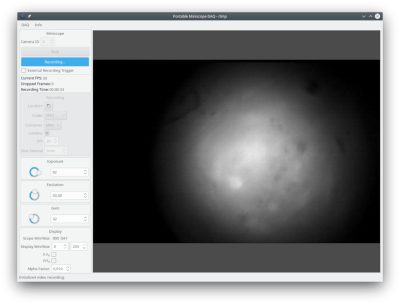

PoMiDAQ
=========

PoMiDAQ is a recording software for [UCLA Miniscopes](http://miniscope.org/index.php/Main_Page).
Unlike the [preexisting](https://github.com/daharoni/Miniscope_DAQ_Software) Miniscope software, this program
is written to be portable, so it will run on Windows, Linux and (likely) macOS.
It is designed to work with the latest OpenCV libraries and provides a shared library, so Miniscope recording
features can easily be embedded into other programs and pipelines.
Recorded data is encoded with the [FFV1](https://en.wikipedia.org/wiki/FFV1) codec by default, to allow for
smaller video files at lossless quality that are safe to archive.

Some features the original Miniscope DAQ software has, like the behavior recording, are intentionally left out.
This software is developed on Linux, but has also been successfully tested on Windows. As of now, no macOS build
has been attempted.

## Developers

### Dependencies

 * cmake (>= 3.12)
 * Qt5 (>= 5.10)
 * Boost (>= 1.66)
 * FFmpeg (>= 4.1)
 * OpenCV (>= 4.1)

Before attempting to build PoMiDAQ, ensure all dependencies (and their development files) are installed on your system.
You should then be able to build the software after configuring the build with cmake for your platform.

Pull-requests are very welcome! (Code should be valid C++14, use 4 spaces for indentation)

## Users

The CI system provides up-to-date builds for PoMiDAQ for the Windows (64-bit) and Debian 9+ (amd64) platforms.
You can fetch builds from there or download prebuilt binaries from the Github releases.
Don't hesitate to file issues if you notice anything unusual - since this software is very new, there is
still a good chance to encounter strange behavior that was not previously tested for.
