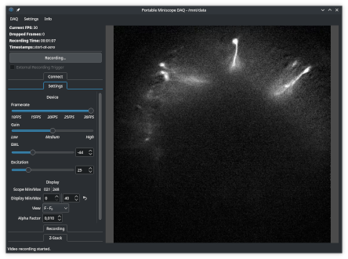

PoMiDAQ
=======

[](https://github.com/bothlab/pomidaq/tree/master/contrib/screenshots)

[](https://github.com/bothlab/pomidaq/actions/workflows/build.yml)
[](https://doi.org/10.5281/zenodo.8225049)

PoMiDAQ is a recording software for UCLA Miniscopes for neuroscientific research.
It provides an easy way to record videos from Miniscopes, create Z-stacks to give an overview of visible cells
or tissue features and provides an online background subtraction feature to gain an initial insight into
cellular calcium activity while data is recorded.

PoMiDAQ was written from the start to be portable, and runs on Linux and Windows
(and could likely be ported to macOS too).

The software provides all Miniscope functions as a shared library, so Miniscope recording features can easily
be embedded into other programs and pipelines.
PoMiDAQ will work with Miniscope V3, V4 and the Siminiscope hardware using the standard DAQ box v3.2.
Recorded data is encoded with the [FFV1](https://en.wikipedia.org/wiki/FFV1) codec by default, to allow for
smaller video files at lossless quality that are safe to archive.

PoMiDAQ also provides an experimental Python module to access a Miniscope easily from Python. This feature has
currently only been tested on Linux (and may stay Linux-only) and is still considered a bit experimental.

Some features like parallel behavior recording, are intentionally left out of PoMiDAQ.
You may like to use [Syntalos](https://github.com/syntalos/syntalos) for advanced multimodal data acquisition
with Miniscopes and a variety of cameras, or try
[Miniscope-DAQ-QT-Software](https://github.com/Aharoni-Lab/Miniscope-DAQ-QT-Software) instead.


## Users

The CI system provides up-to-date builds for PoMiDAQ for the **Windows** (64-bit), **Debian** and **Ubuntu** (amd64) platforms.
You can fetch builds from there or download prebuilt binaries from the [Github releases](https://github.com/bothlab/pomidaq/releases).
Don't hesitate to file issues if you notice anything unusual.

On Linux, you can also just install the software from your software center when Flathub is configured:
<a href="https://flathub.org/apps/details/io.github.bothlab.pomidaq"></a>

If you Linux distribution is Ubuntu 24.04, you can also install PoMiDAQ from the Syntalos PPA:
```bash
sudo add-apt-repository ppa:ximion/syntalos
sudo apt update
sudo apt install pomidaq
```

### Notes
#### On Linux
 * The released binaries were built on Ubuntu 24.04 or Debian 13 respectively. They may work on other Debian-based distributions as well,
   but in case they don't, compiling the application from source is pretty easy to do (for short instructions see below).
 * For Ubuntu 24.04, PoMiDAQ can be installed from the Syntalos PPA (see above)
 * You need at least an OpenGL 3.0-capable graphics driver on your system to run this application.

#### On Windows
 * You will need at least an OpenGL 3.0-capable graphics driver installed, otherwise the application will not start.
 * You will need to trust the executable from an "Unknown Publisher" as it is not signed.
 * Some users reported they can't start PoMiDAQ on Windows because `MF.dll`/`MFPLAT.dll` are missing. In this case,
   you will need to install the [Mediafeaturepack from Microsoft](https://www.microsoft.com/en-us/software-download/mediafeaturepack)
   for your Windows version to resolve the problem. Sometimes enabling this feature via Windows' "Additional Features" selection
   (in the "Apps" page of "Settings") will work better than a manual installation.

#### No BNO orientation information
If you can't record any valid data from the Miniscope's BNO sensor, your firmware version may be too old.
You can test for that by showing the Minscope log (Info → Show Miniscope Log) and check for a warning mentioning
a bad firmware version. If that is the case, please download the latest `Miniscope_DAQ_256K_EEPROM.img` firmware
from [the Miniscope firmware site](https://github.com/Aharoni-Lab/Miniscope-DAQ-Cypress-firmware) and flash
it to your DAQ box.


### Citing

If you want to cite PoMiDAQ, please use its Zenodo DOI:

> Klumpp, Matthias. (2023). PoMiDAQ. Zenodo. https://doi.org/10.5281/zenodo.8225049


## Developers

### Dependencies

 * CMake (>= 3.16)
 * Qt6 (>= 6.6.2)
 * FFmpeg (>= 6.1)
 * OpenCV (>= 4.8)
 * KF6ConfigWidgets (on Linux)
 * [pyBind11](https://github.com/pybind/pybind11) (optional)

Before attempting to build PoMiDAQ, ensure all dependencies (and their development files) are installed on your system.
You should then be able to build the software after configuring the build with cmake for your platform.

On Debian-based Linux systems, all dependencies can be installed from the package repositories with this command:
```bash
sudo apt install build-essential cmake ninja-build qt6-base-dev qt6-svg-dev \
                 libkf6configwidgets-dev libopencv-dev libavcodec-dev libavformat-dev libswscale-dev \
                 pybind11-dev python3-dev python3-numpy
```
The software can then be built like this, for an optimized release build with debug infos included:
```bash
mkdir build && cd build
cmake -GNinja -DCMAKE_BUILD_TYPE=RelWithDebInfo ..
ninja
sudo ninja install
sudo ldconfig
```

Pull-requests are very welcome! (Code should be valid C++14, use 4 spaces for indentation)
